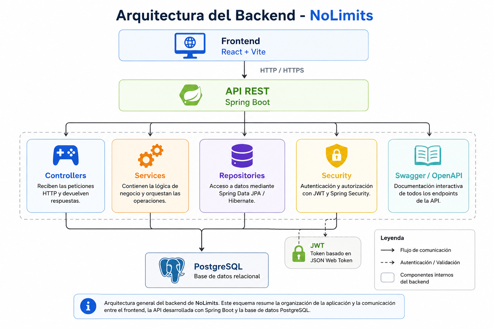

# 🚀 NoLimits Backend


## 📑 Contenido

- 🚀 Descripción
- 🤝 Proyecto colaborativo
- 👥 Equipo de desarrollo
- 👩‍💻 Mi participación
- 🛠 Tecnologías utilizadas
- ✨ Funcionalidades principales
- 🏗 Arquitectura
- 🚀 Instalación
- 🧪 Pruebas
- 🌱 Aprendizajes
- 🙏 Agradecimientos

Backend del proyecto **NoLimits**, desarrollado de forma colaborativa como parte del proyecto de titulación de la carrera **Analista Programador** en **Duoc UC**.

NoLimits es una plataforma web orientada a centralizar información relacionada con videojuegos, películas y series. El backend fue desarrollado utilizando **Spring Boot**, implementando una arquitectura en capas, autenticación segura mediante JWT y una API REST para la comunicación con el frontend.

---

## 🤝 Proyecto colaborativo

Este proyecto fue desarrollado por un equipo de estudiantes durante el proceso de titulación.

Este repositorio representa **mi participación dentro del proyecto**, respetando y reconociendo el trabajo realizado por todos los integrantes del equipo.

El desarrollo de NoLimits fue posible gracias al trabajo colaborativo, la comunicación constante y el compromiso de cada uno de sus participantes.

---

## 👥 Equipo de desarrollo

- Marta Sanhueza
- James
- Christian

> **Nota:** Si mis compañeros están de acuerdo, en el futuro agregaré sus perfiles de GitHub para reconocer también su trabajo y facilitar el acceso a sus contribuciones.

---

## 👩‍💻 Mi participación

Dentro de este proyecto participé principalmente en:

- Desarrollo y mejora de funcionalidades del backend con Spring Boot.
- Implementación y mejora de APIs REST.
- Apoyo en pruebas de software y aseguramiento de calidad (QA).
- Revisión y mejora de documentación técnica.
- Trabajo colaborativo mediante Git y GitHub.
- Participación en revisiones, integración y mejora continua del proyecto.

---

# 🛠️ Tecnologías utilizadas

| Categoría | Tecnologías |
|-----------|-------------|
| **Lenguaje** | Java 17 |
| **Framework** | Spring Boot |
| **Persistencia** | Spring Data JPA / Hibernate |
| **Base de datos** | PostgreSQL |
| **Seguridad** | Spring Security, JWT, BCrypt |
| **Documentación** | Swagger / OpenAPI |
| **Pruebas** | JUnit 5, Mockito, JaCoCo |
| **Control de versiones** | Git y GitHub |
| **Herramientas** | Maven, Docker |

---

# ✨ Funcionalidades principales

El backend proporciona una API REST para soportar las funcionalidades principales de la plataforma.

Entre ellas se encuentran:

- 👤 Registro e inicio de sesión de usuarios.
- 🔐 Autenticación y autorización mediante JWT.
- 📦 Gestión de productos.
- 🖼️ Administración de imágenes.
- 📚 Exposición de servicios REST.
- ✅ Validaciones de datos.
- 📄 Documentación automática con Swagger.
- 🧪 Pruebas unitarias e integración.
- 🏗️ Arquitectura basada en capas para facilitar el mantenimiento y la escalabilidad.

---

# 🏗 Arquitectura

La siguiente imagen muestra la arquitectura general del backend de **NoLimits**, desarrollada con Spring Boot y organizada en una arquitectura en capas.



# 🚀 Instalación

## Requisitos

- Java 17
- Maven
- PostgreSQL

## Clonar el repositorio

```bash
git clone https://github.com/mesc1980/NoLimits-SpringBoot.git
```

## Ejecutar

```bash
mvn spring-boot:run
```

# 🧪 Calidad del software

Durante el desarrollo del proyecto se aplicaron distintas estrategias para asegurar la calidad del software.

Entre ellas:

- Pruebas unitarias con JUnit 5.
- Pruebas utilizando Mockito.
- Medición de cobertura mediante JaCoCo.
- Validación de endpoints REST.
- Documentación automática mediante Swagger.

# 🙏 Agradecimientos

Este proyecto fue posible gracias al trabajo colaborativo desarrollado durante el proceso de titulación.

Quiero agradecer especialmente a mis compañeros de equipo por su compromiso, disposición para colaborar y por todos los aprendizajes compartidos durante el desarrollo de NoLimits.

La experiencia reafirmó la importancia del trabajo en equipo, la comunicación y el desarrollo colaborativo de software.
