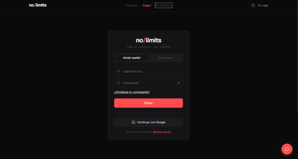
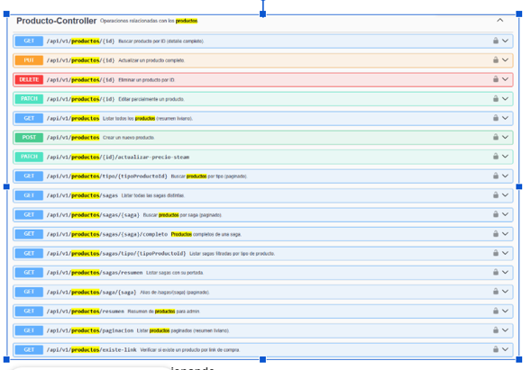

# 🚀 Backend NoLimits

API REST desarrollada con **Spring Boot** para el proyecto colaborativo **NoLimits**, creado como parte del proceso de titulación de **Analista Programador en Duoc UC**.

> Este repositorio documenta mi participación en el desarrollo del backend, reconociendo el trabajo colaborativo del equipo.


## 📑 Contenido

- [📖 Descripción](#-descripción)
- [🤝 Proyecto colaborativo](#-proyecto-colaborativo)
- [👥 Equipo de desarrollo](#-equipo-de-desarrollo)
- [👩‍💻 Mi participación](#-mi-participación)
- [🛠 Tecnologías utilizadas](#-tecnologías-utilizadas)
- [✨ Funcionalidades principales](#-funcionalidades-principales)
- [🏗 Arquitectura](#-arquitectura)
- [🚀 Instalación](#-instalación)
- [🧪 Pruebas](#-pruebas)
- [🌱 Aprendizajes](#-aprendizajes)
- [🙏 Agradecimientos](#-agradecimientos)

Backend del proyecto **NoLimits**, desarrollado de forma colaborativa como parte del proyecto de titulación de la carrera **Analista Programador** en **Duoc UC**.

# 📖 Descripción

NoLimits es una plataforma web desarrollada como proyecto de titulación de la carrera **Analista Programador** en **Duoc UC**.

Su objetivo es centralizar información relacionada con videojuegos, películas y series mediante una arquitectura moderna basada en una API REST desarrollada con Spring Boot y un frontend construido con React.

Este repositorio corresponde al backend del proyecto y documenta mi participación dentro del equipo de desarrollo.
---

## 🤝 Proyecto colaborativo

Este proyecto fue desarrollado por un equipo de estudiantes durante el proceso de titulación.

Este repositorio representa **mi participación dentro del proyecto**, respetando y reconociendo el trabajo realizado por todos los integrantes del equipo.

El desarrollo de NoLimits fue posible gracias al trabajo colaborativo, la comunicación constante y el compromiso de cada uno de sus participantes.

---

## 👥 Equipo de desarrollo

- Marta Sanhueza
- James
- Christian

> **Nota:** Si mis compañeros están de acuerdo, en el futuro agregaré sus perfiles de GitHub para reconocer también su trabajo y facilitar el acceso a sus contribuciones.

---

## 👩‍💻 Mi participación

Dentro de este proyecto participé principalmente en:

- Desarrollo y mejora de funcionalidades del backend con Spring Boot.
- Implementación y mejora de APIs REST.
- Apoyo en pruebas de software y aseguramiento de calidad (QA).
- Revisión y mejora de documentación técnica.
- Trabajo colaborativo mediante Git y GitHub.
- Participación en revisiones, integración y mejora continua del proyecto.

---

# 🛠️ Tecnologías utilizadas

| Categoría | Tecnologías |
|-----------|-------------|
| **Lenguaje** | Java 17 |
| **Framework** | Spring Boot |
| **Persistencia** | Spring Data JPA / Hibernate |
| **Base de datos** | PostgreSQL |
| **Seguridad** | Spring Security, JWT, BCrypt |
| **Documentación** | Swagger / OpenAPI |
| **Pruebas** | JUnit 5, Mockito, JaCoCo |
| **Control de versiones** | Git y GitHub |
| **Herramientas** | Maven, Docker |

---

# ✨ Funcionalidades principales

El backend proporciona una API REST para soportar las funcionalidades principales de la plataforma.

Entre ellas se encuentran:

- 👤 Registro e inicio de sesión de usuarios.
- 🔐 Autenticación y autorización mediante JWT.
- 📦 Gestión de productos.
- 🖼️ Administración de imágenes.
- 📚 Exposición de servicios REST.
- ✅ Validaciones de datos.
- 📄 Documentación automática con Swagger.
- 🧪 Pruebas unitarias e integración.
- 🏗️ Arquitectura basada en capas para facilitar el mantenimiento y la escalabilidad.

---

# 🏗 Arquitectura

La siguiente imagen muestra la arquitectura general del backend de **NoLimits**, desarrollada con Spring Boot y organizada en una arquitectura en capas.


# 📸 Capturas del sistema

A continuación se muestran algunas de las principales pantallas del proyecto **NoLimits**, incluyendo la interfaz de usuario y la documentación interactiva de la API.

---

## 🏠 Página principal

Vista inicial de la plataforma donde los usuarios pueden explorar las diferentes sagas y productos disponibles.


---

## 🔐 Inicio de sesión

Pantalla de autenticación que permite acceder a las funcionalidades personalizadas de la plataforma.



---

## 📦 Gestión de productos

Vista del catálogo de productos con sus diferentes opciones de exploración.


---

## 👤 Perfil de usuario

Sección donde el usuario puede administrar su información personal y configurar su cuenta.


---

## 📖 Documentación Swagger

Ejemplo de ejecución de un endpoint desde Swagger/OpenAPI mostrando la petición y la respuesta obtenida desde la API.




# 🚀 Instalación

## Requisitos

Antes de ejecutar el proyecto, asegúrate de contar con:

- Java 17
- Maven 3.9 o superior
- PostgreSQL
- Git

## Clonar el repositorio

```bash
git clone https://github.com/mesc1980/NoLimits-SpringBoot.git
```

## Acceder al proyecto

```bash
cd NoLimits-SpringBoot
```

## Ejecutar

```bash
mvn spring-boot:run
```

Una vez iniciado el servidor, la API estará disponible en:

```
http://localhost:8080
```

La documentación Swagger podrá consultarse en:

```
http://localhost:8080/swagger-ui/index.html
```

---

# 🧪 Calidad del software

Durante el desarrollo del proyecto se aplicaron distintas estrategias para asegurar la calidad del software y mantener una arquitectura robusta.

Entre las principales actividades realizadas destacan:

- Desarrollo de pruebas unitarias con JUnit 5.
- Uso de Mockito para simular dependencias durante las pruebas.
- Medición de cobertura de código utilizando JaCoCo.
- Validación de endpoints REST.
- Documentación automática mediante Swagger/OpenAPI.
- Trabajo colaborativo utilizando Git y GitHub.

---

# 🌱 Aprendizajes

El desarrollo de NoLimits representó una oportunidad para fortalecer conocimientos técnicos y habilidades de trabajo colaborativo.

Durante este proyecto pude desarrollar competencias en:

- Desarrollo de aplicaciones backend con Spring Boot.
- Diseño e implementación de APIs REST.
- Gestión de bases de datos PostgreSQL.
- Implementación de autenticación mediante JWT.
- Uso de Git y GitHub en equipos de desarrollo.
- Aplicación de pruebas de software y aseguramiento de calidad.
- Documentación técnica y buenas prácticas de desarrollo.
- Comunicación y colaboración dentro de un equipo de desarrollo.

# 🙏 Agradecimientos

Este proyecto fue posible gracias al trabajo colaborativo desarrollado durante el proceso de titulación.

Quiero agradecer especialmente a mis compañeros de equipo por su compromiso, disposición para colaborar y por todos los aprendizajes compartidos durante el desarrollo de NoLimits.

La experiencia reafirmó la importancia del trabajo en equipo, la comunicación y el desarrollo colaborativo de software.

---

# 📄 Licencia

Este repositorio tiene fines académicos y forma parte del proyecto de titulación desarrollado en Duoc UC.

El código se publica como muestra de mi participación en el proyecto y con fines de portafolio profesional.
